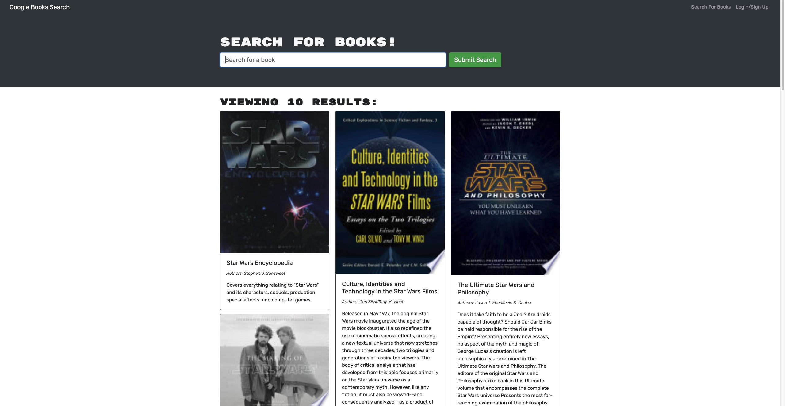

# Book Search Engine

## Summary
This is a full stack MERN application that uses tha Google Books API to search books for users to save to their personal profile. An authenticated user can search the entire Google Books database and save books to their profile.

## Technologies Used
* JavaScript
* MongoDB
* Express.js
* React
* Node.js
* Google Books
* Bootstrap

## Website Screenshot

## Website Link
https://serene-journey-92194.herokuapp.com/